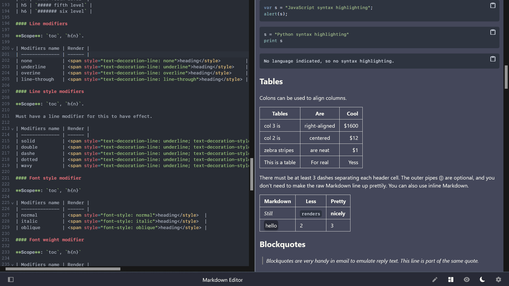
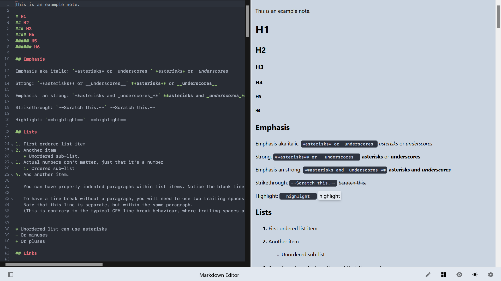
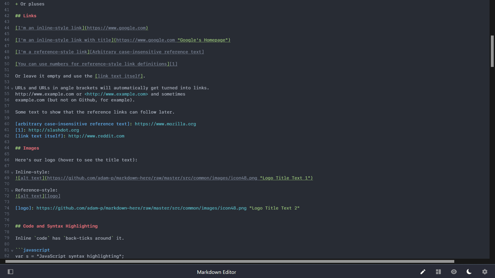
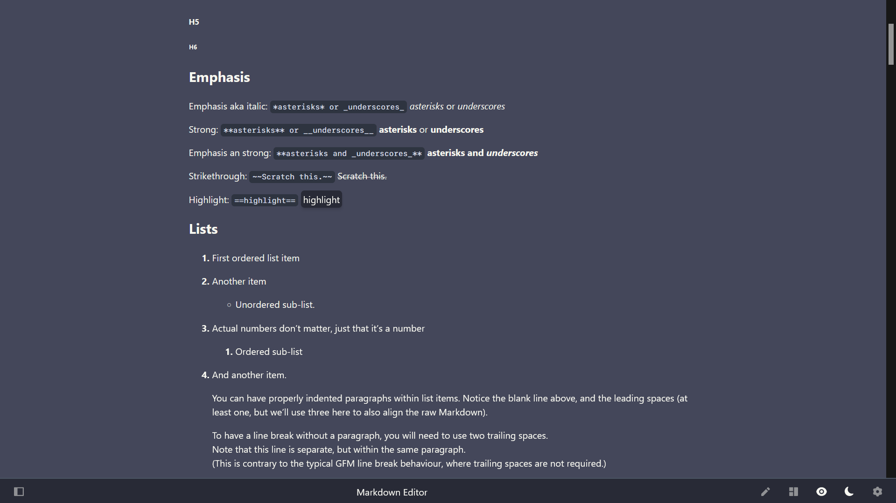
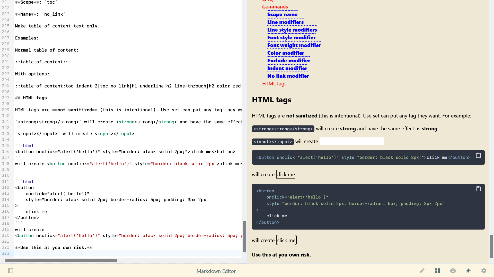
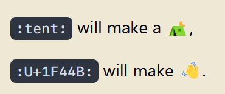
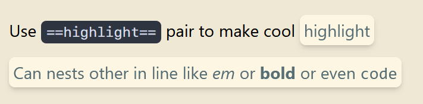
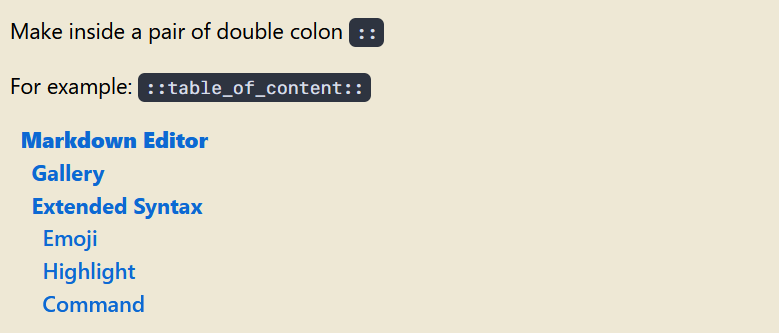

# Markdown Editor

A simple markdown editor with preview.

## Gallery

Support Github flavored Markdown (GFM).

 

 

 

 

 

 

##  Extended Syntax

### Emoji

You can insert emoji using unicode or it's github shortname.

 

 

### Highlight

 

 

### Command

 

 

Read more at [this documentation](./markdown-features.md).